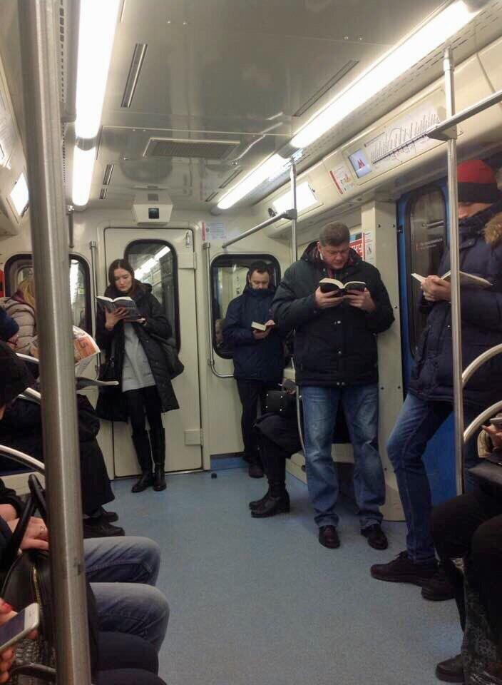

  
According to a [report published in Guardian](https://www.theguardian.com/us-news/2025/aug/20/reading-for-pleasure-study), reading for fun in the US has declined by 40% over the last 20 years. I am sure many people experienced this observation in their lives directly. When I was getting ready to move from Syracuse, NY to start working as a Graduate Assistant at the Institute for Democracy, Journalism and Citizenship in Washington, D.C. I was excited and telling people that I would finally live like a "civilized" person. Part of what this meant for me was simple: I would be living in one of the Maryland counties bordering the capital, and I would take the subway to the center of the city everyday. The anticipation of the promise of reading in public transportation was what made the deal sweeter for me. I had not really had the chance to use public transportation as I used to since I arrived in the United States in 2019. I just did not consider what little experience I had with public transportation to be representative. It was mostly negative and I remember thinking that at least "cultural" centers of this country are bound to be different. 

This probably unrealistic expectation I had about the United States stems from my experience living and learning Russian in the westernmost region of Russia, [Kaliningrad](https://en.wikipedia.org/wiki/Kaliningrad). While attending a language school and living by myself in an apartment for maximum immersion in culture, I started using the old tram network operating in the city. From the first time until the last ever time I rode it, I came across people of all ages immersed in books and as an avid reader, I was happy to be in such good company. As I was talking to the teachers in the school, they were amused by how happy I sounded, but they were quick to add that there is a part of the new generation that does not read.

Fast forward more than a decade. I remember the first time I took the subway to the center of the capital, but I think words will fail me should I try to express the level of disappointment I had.:disappointed: I changed lines at the Metro Center and I did not come across a single person reading a book on the first leg of this journey. I did this trip hundreds of times. What I got instead was people eating, drinking, speaking loudly on the phone, and listening to music without headphones, littering, and some people just being obnoxious. 

The second part of the trip (from Metro Center to the DuPont Circle) was arguably better and in this line I actually came across people reading physical books as well as using electronic book readers.:clap: Because the trains were mostly crowded on that line, I just stood close to the doors and wrapped up my reading for the commute while doing a balancing act. I made a point of getting into a different car every time as this became a little side project for me. "What if all readers are on the first car?":thinking: I saw very few people reading books. This was coupled with a curious (but for me quite expected) phenomenon: On multiple occasions, the readers acknowledged each other, including me. On various occasions, I was the one to initiate the acknowledgment. From a political psychology standpoint, we already know that we all have a need to have our beliefs confirmed[^1], and the smaller the group, the more intense this need becomes.[^2] Let us unwrap this statement: If most people are acting in a certain way, the active need that people has towards that way of acting is minimal. In that sense, when most people are simply lost in their cell phones, they would not think anything amiss or have any doubts about the value of what they are doing. This is simply because they are surrounded by people just like them (acting just like them) and their belief is validated again and again. But when you are in the minority and one of the few readers among a group of people lost in their cell phones, the need to have your belief confirmed increases. The need to simply have someone tell you that what you are doing (reading in general and reading in the metro in particular) makes sense and is valid. On two occasions, I was approached by other fellow readers upon disembarking the train at DuPont metro station. Pleasantries were exchanged with questions about the books read by the two parties, addressing the heightened need for confirmation of beliefs (in this case a fundamental belief about the place of reading in one's life). This last one suggested that mirroring the decline in reading among the population, readers are a vanishingly small minority among commuters in the nation's capital (not yet among the general public but we are getting there). In comparison, here is an image that accompanied a [Reddit discussion](https://www.reddit.com/r/ANormalDayInRussia/comments/8phoqh/just_a_normal_moscow_subway/) about reading in another capital's metro system: 

I am proud to be a part of the dwindling group of active readers in the United States. We know what follows from political psychology. When the group is sufficiently small, the need to believe that what the group is doing is right becomes too strong that the group simply doubles down on their beliefs.[^3] Above, I briefly discussed the manifestation of this at the individual level. (No, the reading pubic is still large enough not to qualify as a cult.:chart_with_downwards_trend:)  What does that mean for the readers and reading in the United States? How does this increased need manifest itself at the national level? For two consecutive years (2024-2025) [the sales of print books increased](https://www.publishersweekly.com/pw/by-topic/industry-news/financial-reporting/article/99417-print-book-sales-rose-slightly-in-2025.html). I read this increase in sales of physical books as the illustration of the very real need of the readers to double down. Is the increase good news? Yes. Is the number of readers increasing? Probably not. 

What we are seeing is simply the reading public mounting a resistance! :muscle:   

[^1]: Festinger, Leon. 1957. *A Theory of Cognitive Dissonance.* Stanford University Press.
[^2]: Festinger, Leon. 1950. "Informal Social Communication." Psychological Review 57(5): 271-282.
[^3]: Festinger, Leon and Henry W. Riecken and Stanley Schachter. 1956. *When Prophecy Fails.* University of Minnesota Press.

::: {.content-visible when-format="html"}
:::